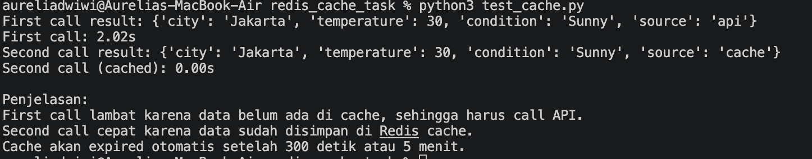

# Cache Report - Redis Weather API

## 1. Deskripsi Tugas

Tugas ini mengimplementasikan caching sederhana menggunakan Redis untuk menyimpan hasil API call cuaca. Fungsi `get_weather(city)` dimodifikasi agar tidak selalu melakukan API call lambat setiap kali dipanggil.

Alur kerja caching:

1. Sistem mengecek data cuaca di Redis menggunakan key `weather:{city}`.
2. Jika data ditemukan di cache, sistem langsung mengembalikan data dari Redis.
3. Jika data tidak ditemukan, sistem menjalankan API call yang lambat.
4. Hasil API call disimpan ke Redis.
5. Cache diberi waktu kedaluwarsa selama 5 menit atau 300 detik.

---

## 2. File yang Dibuat atau Dimodifikasi

Dokumentasi ini mencakup file berikut:

| File               | Keterangan                                                                         |
| ------------------ | ---------------------------------------------------------------------------------- |
| `weather_api.py`   | Berisi fungsi `get_weather(city)` yang sudah menggunakan Redis caching             |
| `test_cache.py`    | Berisi script testing untuk membandingkan response time first call dan second call |
| `requirements.txt` | Berisi dependency Python yang digunakan, yaitu `redis` dan `requests`              |
| `cache_report.md`  | Dokumentasi hasil implementasi caching                                             |

---

## 3. Kode yang Dimodifikasi

File utama yang dimodifikasi adalah `weather_api.py`.

```python
import json
import time
import redis


redis_client = redis.Redis(
    host="localhost",
    port=6379,
    db=0,
    decode_responses=True
)


def call_weather_api(city):
    """
    Simulasi API call yang lambat.
    """
    time.sleep(2)

    return {
        "city": city,
        "temperature": 30,
        "condition": "Sunny",
        "source": "api"
    }


def get_weather(city):
    """
    Mengambil data cuaca dengan Redis caching.
    """
    cache_key = f"weather:{city.lower()}"

    cached_data = redis_client.get(cache_key)

    if cached_data:
        data = json.loads(cached_data)
        data["source"] = "cache"
        return data

    data = call_weather_api(city)

    redis_client.set(cache_key, json.dumps(data))
    redis_client.expire(cache_key, 300)

    return data
```

---

## 4. Kode Testing

Testing dilakukan menggunakan file `test_cache.py`.

```python
import time
from weather_api import get_weather


start = time.time()
result1 = get_weather("Jakarta")
time1 = time.time() - start

print("First call result:", result1)
print(f"First call: {time1:.2f}s")


start = time.time()
result2 = get_weather("Jakarta")
time2 = time.time() - start

print("Second call result:", result2)
print(f"Second call (cached): {time2:.2f}s")


print("\nPenjelasan:")
print("First call lambat karena data belum ada di cache, sehingga harus call API.")
print("Second call cepat karena data sudah disimpan di Redis cache.")
print("Cache akan expired otomatis setelah 300 detik atau 5 menit.")
```

---

## 5. Hasil Testing

Hasil testing menunjukkan bahwa pemanggilan pertama membutuhkan waktu lebih lama karena data belum tersedia di cache. Pemanggilan kedua menjadi jauh lebih cepat karena data sudah tersedia di Redis.

Contoh output:

```text
First call result: {'city': 'Jakarta', 'temperature': 30, 'condition': 'Sunny', 'source': 'api'}
First call: 2.00s

Second call result: {'city': 'Jakarta', 'temperature': 30, 'condition': 'Sunny', 'source': 'cache'}
Second call (cached): 0.00s
```

### Screenshot Hasil Test

Masukkan screenshot terminal yang menunjukkan hasil:

```text
First call: 2.00s
Second call (cached): 0.00s
```

Letakkan screenshot di folder berikut:

```text
docs/screenshots/cache-test.png
```

Lalu tampilkan di dokumentasi dengan format:

```markdown

```


---

## 6. Redis Commands yang Digunakan

### 6.1 SET

Command `SET` digunakan untuk menyimpan hasil API call ke Redis.

Implementasi di Python:

```python
redis_client.set(cache_key, json.dumps(data))
```

Contoh command Redis:

```bash
SET weather:jakarta "{\"city\": \"Jakarta\", \"temperature\": 30, \"condition\": \"Sunny\"}"
```

---

### 6.2 GET

Command `GET` digunakan untuk mengambil data dari Redis berdasarkan key.

Implementasi di Python:

```python
cached_data = redis_client.get(cache_key)
```

Contoh command Redis:

```bash
GET weather:jakarta
```

---

### 6.3 EXPIRE

Command `EXPIRE` digunakan untuk memberi waktu kedaluwarsa pada cache. Pada tugas ini, cache disimpan selama 300 detik atau 5 menit.

Implementasi di Python:

```python
redis_client.expire(cache_key, 300)
```

Contoh command Redis:

```bash
EXPIRE weather:jakarta 300
```

---

## 7. Cara Menjalankan Redis

Redis dijalankan menggunakan Docker dengan command berikut:

```bash
docker run --name redis-cache -p 6379:6379 -d redis:7
```

Untuk mengecek apakah Redis sudah berjalan:

```bash
docker ps
```

Untuk mengetes koneksi Redis:

```bash
docker exec -it redis-cache redis-cli ping
```

Output yang diharapkan:

```text
PONG
```

---

## 8. Cara Menjalankan Testing

Install dependency:

```bash
python3 -m pip install -r requirements.txt
```

Jalankan testing:

```bash
python3 test_cache.py
```

Untuk menghapus cache agar first call menjadi lambat lagi:

```bash
docker exec -it redis-cache redis-cli DEL weather:jakarta
```

---

## 9. Jawaban Pertanyaan

### 9.1 Kenapa response time berbeda?

Response time berbeda karena pada pemanggilan pertama data belum tersedia di Redis cache. Akibatnya, sistem harus menjalankan API call yang disimulasikan lambat selama 2 detik.

Pada pemanggilan kedua, data sudah tersimpan di Redis. Sistem tidak perlu menjalankan API call lagi, sehingga response menjadi jauh lebih cepat karena data langsung diambil dari cache.

---

### 9.2 Apa keuntungan caching?

Keuntungan caching adalah:

1. Mengurangi response time API.
2. Mengurangi beban server.
3. Mengurangi jumlah request ke API eksternal.
4. Menghemat bandwidth.
5. Meningkatkan pengalaman pengguna karena aplikasi terasa lebih cepat.

Dalam tugas ini, caching berhasil mengurangi waktu response dari sekitar 2 detik menjadi kurang dari 0.1 detik pada pemanggilan kedua.

---

### 9.3 Kapan sebaiknya tidak menggunakan cache?

Cache sebaiknya tidak digunakan ketika data harus selalu real-time atau sangat sering berubah.

Contoh data yang sebaiknya tidak menggunakan cache terlalu lama:

1. Saldo rekening.
2. Status pembayaran real-time.
3. OTP atau kode verifikasi.
4. Data stok barang yang berubah sangat cepat.
5. Data medis atau data sensitif yang harus selalu akurat.

Jika cache digunakan pada data seperti itu, user bisa menerima data lama atau tidak akurat.

---

## 10. Kesimpulan

Implementasi Redis caching pada fungsi `get_weather(city)` berhasil meningkatkan performa API call. Pemanggilan pertama membutuhkan waktu sekitar 2 detik karena sistem masih mengambil data dari API. Pemanggilan kedua menjadi sangat cepat karena data sudah tersedia di Redis cache.

Dengan menggunakan operasi dasar Redis seperti `GET`, `SET`, dan `EXPIRE`, sistem dapat menyimpan data sementara selama 5 menit dan mengurangi proses API call yang berulang.
